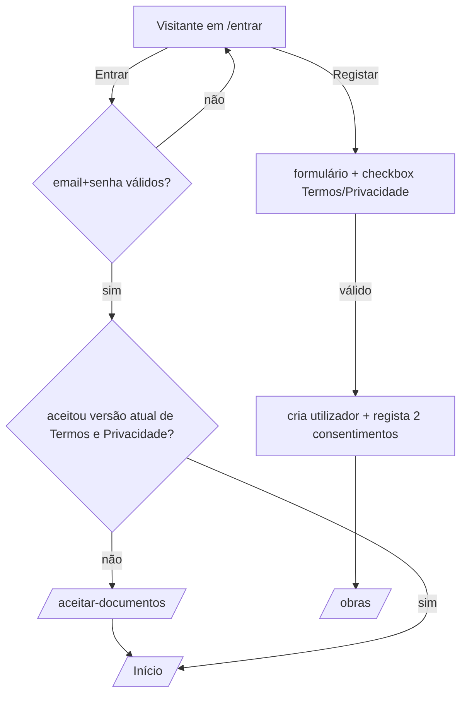
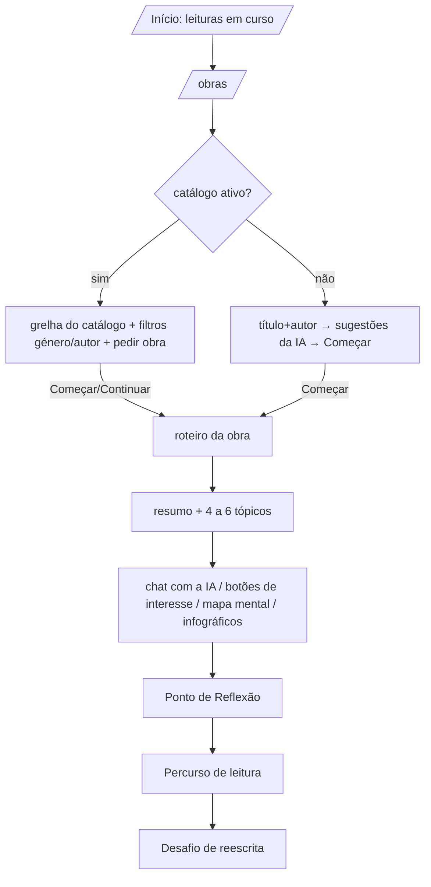
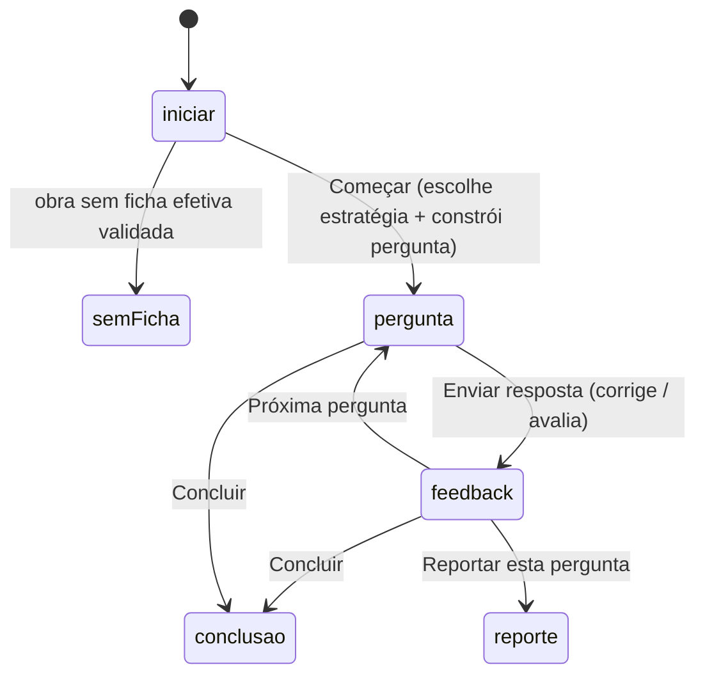

# 02. Fluxos e ecrãs

Na aplicação Streamlit a navegação é uma variável de sessão (`st.session_state["tela"]`) e **todos os ecrãs são uma só página**. No Next.js cada ecrã passa a ter **rota própria**. A coluna «Rota» propõe os caminhos; «Streamlit» diz onde está o código atual (para consultar a lógica).

## Mapa de rotas

| Rota proposta | Streamlit (`tela`) | Acesso | Ficheiros atuais |
|---|---|---|---|
| `/entrar`, `/registar` | `login` (separadores) | visitante | `views/login.py` |
| `/recuperar-senha`, `/nova-senha` | `recuperar_senha`, `nova_senha` | visitante | `views/password_recovery.py` (**stub**, ver doc 11) |
| `/termos`, `/privacidade` | `termos`, `privacidade` | público | `views/legal.py`, `utils/legal.py`, `assets/*.md` |
| `/contacto` | `contacto` | público | `views/contacto.py`, `utils/contactos.py` |
| `/aceitar-documentos` | `consentimento` | autenticado, versão por aceitar | `views/legal.py` |
| `/` (Início) | `inicial` | leitor | `views/painel.py` |
| `/obras` | `pesquisa_obra` | leitor | `views/obra_search.py` |
| `/obras/[obraId]/roteiro` | `chat` | leitor | `views/chat.py`, `views/visuais_ui.py` |
| `/obras/[obraId]/reflexao` | `checkpoint` | leitor | `views/checkpoint_novo.py` (motor novo) |
| `/obras/[obraId]/percurso` | `relatorio` | leitor (dono) | `views/relatorio.py`, `utils/relatorio.py` |
| `/reescrita/[checkpointId]` | `reescrita` | leitor (dono) | `views/reescrita.py` |
| `/area-do-leitor` (abas) | `area_leitor` | leitor | `views/area_do_leitor.py`, `views/comunidade.py` |
| `/perfil` | `perfil` | leitor | `views/profile.py`, `views/legal.py` (`secao_meus_dados`) |
| `/turmas` | `turmas` | leitor (modo professor ligado) | `views/turmas.py` |
| `/inquerito` | `inquerito` | leitor (inquérito aberto) | `views/inquerito.py` |
| `/professor`, `/professor/turmas/[id]` | `professor` | professor | `views/professor*.py` |
| `/admin/...` (11 secções) | `admin` | administrador | `views/admin*.py` |

**Guardas globais** (a replicar em middleware/layout): (1) sem sessão → `/entrar`, exceto as páginas públicas; (2) sessão sem aceitação das versões atuais dos Termos e da Privacidade → `/aceitar-documentos` (a página só deixa continuar depois de aceitar; ver doc 04 §Consentimento); (3) com o catálogo restrito, abrir `roteiro`/`reflexao` de uma obra **fora do catálogo** (e fora das obras das turmas do leitor) mostra aviso e leva ao catálogo; (4) perfil incompleto (`idade`, `cidade`, `interesses` em falta) bloqueia o ecrã «Obras» com convite a completar o perfil.

## Barra lateral (navegação global)

Estrutura (`views/sidebar.py`), por esta ordem:

- Logótipo; saudação «👋 Nome»; sem obra aberta mostra «N leitura(s) · X pontos no total».
- **Principal:** Início · Explorar obras · Área do Leitor · (se o modo professor estiver ligado) As minhas turmas.
- **«A ler agora»** (só com obra aberta): título, **nível, pontos e barra de progresso** do nível; atalhos para **Roteiro** e **Ponto de Reflexão**.
- **Ensino** (professor, modo ligado): Painel do professor.
- **Gestão** (administrador): Administração, com um **número de pendências** = reportes novos + pedidos de obra + contactos por tratar + pedidos de professor (cache de ~60 s).
- **Conta:** O meu perfil · Sair.
- Rodapé: **Inquérito** (botão interno se o inquérito interno estiver aberto; senão ligação externa configurável) · Ajuda e reportar problema (`mailto:` do email de ajuda) · Contacto · Termos · Privacidade.
- O item do ecrã atual fica destacado; em ecrãs pequenos abre recolhida.

## Fluxos principais

### 1. Registo, entrada e consentimento

Campos do registo (todos obrigatórios): nome, email (formato válido, único), senha + confirmação, **nível educacional** (`Fundamental`/`Secundário`/`Superior`), **hábito de leitura** (`Não gosto`/`Casual`/`Frequente`), **idade** (14–100), **cidade**, **interesses** (texto livre), opção de partilha do perfil (`opcao_compartilhar`: partilhar ou não; define se o nome aparece no fórum), e o aceite dos Termos e da Privacidade (botão «Registar» desativado até estar tudo válido). Depois de registar, vai direto a «Obras» e fica com sessão iniciada.

Sessão: guarda id, nome, email, idade, cidade, interesses, nível educacional, hábito, `opcao_compartilhar`, `is_admin`, `is_professor`, `variante_pt`.

### 2. Escolher uma obra e ler

- **Catálogo ativo:** grelha de 3 colunas (capa, título, autor, ano, género), pesquisa sem acentos nem maiúsculas, filtros de género e autor, «Mostrar mais» (12 de cada vez), as obras já em leitura aparecem marcadas com «Continuar», «Sobre a obra» (resumo e temas da ficha) e link para o texto integral se for domínio público. «Pedir uma obra» (título + autor; máx. 5 pedidos pendentes por leitor). A lista «Os meus pedidos» mostra o estado.
- **Catálogo desligado:** o leitor escreve título e autor, a IA devolve até 5 obras reais; escolhe uma e «Começar» cria a obra (se não existir) e o roteiro. Avisa que a IA pode errar.
- **Roteiro:** abre-se o roteiro existente ou cria-se (um por obra e leitor).

### 3. Roteiro (chat)

1. Mostra o **resumo** guardado em `roteiros.resumo`; se não existir, gera-o com a IA (≈250 tokens, adaptado a idade, cidade e interesses) e guarda-o. O resumo termina com a lista «### Tópicos para explorar» (4 a 6 perguntas curtas) que a interface transforma em **botões**.
2. **Botões de interesse** (7): Contexto Histórico, Curiosidades, Impacto Cultural, Estilo, Questões Intrigantes, Moral, Personagens. Cada um gera uma resposta da IA com prompt próprio e regista-a na conversa. Cada botão está associado a dois níveis de Bloom (`TAXONOMY_MAP`).
3. **Chat livre** (caixa de texto): guarda a mensagem do leitor e a resposta da IA em `chat_messages` (`role` = `user` ou `RELIA`). A IA recebe as últimas 10 mensagens como contexto.
4. **Mapa mental** (interruptor): ramos e ideias-chave construídos a partir dos pares pergunta/resposta (até 10 ramos, 5 ideias por ramo), guardado em `roteiro_mapa`, desenhado em SVG e descarregável; «Refazer mapa» apaga-o.
5. **Infográfico** sob cada resposta da IA («Ver infográfico»): só gera ao carregar (gasta IA), guarda em `infograficos` (por `roteiro_id` + chave do par) e mostra em HTML.
6. Barra de ações: «📊 Percurso de leitura» e «▶️ Ponto de Reflexão».

### 4. Ponto de Reflexão (motor novo)

- Cabeçalho com nível e barra de progresso (pontos acumulados do roteiro).
- **Pergunta** mostra formato, verbo e «vale até N pontos». Campos por formato: escolha múltipla (rádio), verdadeiro/falso (um rádio por afirmação), completar (um select por lacuna), associar (um select por par), ordenar (posição de cada item), resposta curta/aberta (texto; mínimo 3 palavras e diferente do enunciado). **«Enviar resposta» fica desativado até estar tudo respondido.**
- **Correção:** objetivas pela aplicação (crédito parcial); abertas pela IA, por critérios. Mostra pontos («X de Y pontos»), feedback, gabarito (abertas, em «Ver o gabarito»), subida de nível (balões) e «Reportar esta pergunta».
- **Reportar:** motivo (6 opções) + comentário (≤500), um por pergunta e por leitor, só das suas.
- Sem ficha efetiva validada: mensagem explicativa, sem perguntas.
- Se a IA falhar ao avaliar: mensagem de erro e a resposta **não se perde** (pode reenviar).

### 5. Percurso de leitura (relatório)

Abre-se por «Relatório» na Área do Leitor, ou «📊 Percurso de leitura» no roteiro. Blocos, de cima para baixo: cabeçalho (capa, nível, pontos, respostas, dias de leitura, barra) · **Próximo passo** (texto + botões «Ponto de Reflexão» e «Roteiro») · **Desafio de reescrita** (até 3 respostas fracas) · **Leitura do seu percurso** (IA, a pedido) · **Trajetória** (pontos acumulados + tendência) · **Por nível de Bloom** (barras) · **A sua voz** (4 abas) · **As suas respostas** (expansores) · **Receber por email**. Regras e fórmulas no doc 04.

### 6. Desafio de reescrita

Lista no relatório as respostas **abertas** do motor novo com nota < 70 % e tentativas por usar. No ecrã: pergunta, resposta anterior, feedback recebido, caixa para nova resposta. **O gabarito só aparece depois de enviar.** Depois: «Antes X% → Agora Y%», novo feedback, gabarito. **Não dá pontos.** Máx. 2 tentativas por resposta; ≤10 reescritas por dia.

### 7. Turma (estudante)

`/turmas`: lista as turmas do estudante (nome, professor, **o seu número**, obras atribuídas com «Abrir», prazo e orientação), **toggle «Partilhar o meu percurso com o professor»** (desligado por omissão), «Sair da turma»; formulário «Entrar numa turma» (código de 6 caracteres + checkbox a confirmar o aviso de privacidade); secção «Sou professor/a» para pedir acesso (escola + motivo).

### 8. Professor

`/professor`: lista de turmas + «Nova turma» (nome, ano letivo; ≤20 turmas). Detalhe da turma com 4 separadores: **Estudantes e obras** (tabela por número com obras iniciadas, respostas, pontos, última resposta e se partilhou; obras atribuídas com prazo/orientação e «Retirar»; atribuir obra do catálogo; adicionar obra fora do catálogo; «Percursos partilhados»), **Relatório da turma** (por obra), **Fichas** (gerar/editar/validar ficha própria) e **Perguntas** (banco: propostas, aprovar/rejeitar, escrever pergunta aberta, retirar). Ações da turma: novo código, arquivar/reabrir, apagar (com confirmação).

### 9. Administração (11 secções)

1. **Painel:** 6 indicadores (últimos 7 dias vs 7 anteriores: utilizadores ativos, novos, leituras começadas, perguntas no chat, Pontos de Reflexão, mensagens no fórum), mapa de calor de atividade (90 dias, hora de Lisboa), atualização a cada 30 s, **resumo semanal escrito pela IA** (guardado em `resumos_semanais`). Interruptor para incluir ou não administradores nos números.
2. **Pedagogia:** funil (registo → … → nível Analisar), leitores por nível, obras onde os leitores ficam a meio (exportar CSV).
3. **Utilizadores:** tabela editável, filtros, ações em lote (tornar/retirar admin, apagar com cascata e confirmação por escrita), regra: nunca ficar sem administradores nem retirar a si próprio.
4. **Obras e roteiros:** editar/criar/apagar/juntar obras; ver roteiros (conversa, Pontos de Reflexão, mapa mental).
5. **Catálogo:** interruptores (catálogo ativo; bloquear leituras fora do catálogo), **pedidos de obras**, **fichas** (gerar rascunho com IA, editar, validar, pôr/retirar do catálogo, cobertura de perguntas, procurar texto integral) e **imagens do Wikimedia Commons**.
6. **Perguntas:** interruptor do motor novo, tabela de estratégias (editar verbo, dificuldade, pontos, ativa, modelo, critérios; estatísticas), **reportes** (estado, resolver, desativar estratégia).
7. **Professores:** interruptor «modo professor»; pedidos (aprovar/recusar); professores (retirar acesso); turmas (**ver a identidade dos estudantes**, auditado); fichas dos professores (promover para o catálogo).
8. **Contactos:** caixa de entrada (filtros, estados, nota, «Responder» por `mailto:`, prazo de 30 dias para pedidos de dados, CSV).
9. **Inquérito:** abrir/fechar, quando convidar, resultados (SUS, NPS, intenção…), por grupo (n≥5), comentários, exportação CSV + dicionário, apagar respostas de uma versão.
10. **Moderação:** discussões do fórum com o nome verdadeiro dos autores; apagar tópicos/respostas.
11. **Auditoria** e **Sistema** (estado: uso da IA, erros, base de dados; definições: ligação/texto/locais do inquérito, email de ajuda, responsável pelo tratamento, aceitações por versão e CSV).

### 10. Outros ecrãs

- **Início:** «Olá, Nome», «➕ Começar nova obra», convite discreto ao inquérito (depois de N respostas de reflexão), cartões das leituras em curso (até 6, 3 colunas: capa, título, barra de nível, pontos, «Continuar»; obras fora do catálogo ficam com 🔒).
- **Área do Leitor** (abas): *Meus Roteiros* (lista com pesquisa e filtro por género; «Continuar» e «Relatório»), *Conquistas* (6 insígnias), *Comunidade* (Fórum e Clubes do Livro), *Desafios* (4). Regras no doc 04.
- **Perfil:** editar nome, idade, cidade, interesses, nível educacional, hábito, **variante do português**, partilha de dados; email só leitura; palavra-passe (campo para nova). Secção **«Os meus dados»**: descarregar JSON e **eliminar a conta** (escrever `APAGAR`; um administrador único não se elimina).
- **Contacto** (público): categoria (dúvida, problema técnico, sugestão, pedido sobre dados pessoais, outro), assunto, mensagem, nome/email (preenchidos com sessão), confirmação de leitura da Privacidade, **campo-armadilha** escondido, tempo mínimo de 4 s, limites 3/h e 10/dia por email.
- **Inquérito:** 22 itens (ver anexo), consentimento obrigatório para investigação, uma resposta por leitor; anónimo.
- **Termos e Privacidade:** páginas com versão, data, responsável e email preenchidos (`{{VERSAO}}`, `{{DATA}}`, `{{RESPONSAVEL}}`, `{{EMAIL}}` em `assets/*.md`).

## Estados de erro e vazios (a manter)

Cada ecrã tem mensagem para: sem ficha validada · IA indisponível («tente de novo daqui a pouco», sem perder a resposta do leitor) · limite diário atingido · sem permissões · obra fora do catálogo · turma arquivada/código inválido · sem dados (relatório sem respostas, turma sem estudantes, banco vazio).
