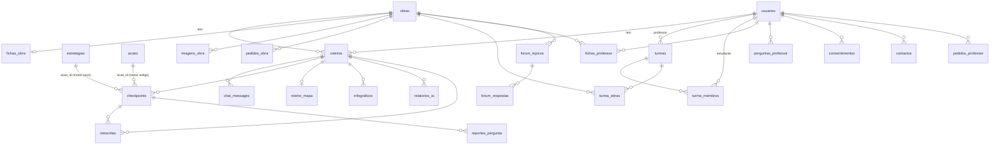

# 03. Modelo de dados

Base: **SQLite/libSQL no Turso**. O esquema completo e atual (36 tabelas, gerado do código numa base nova) está em [`anexos/schema.sql`](anexos/schema.sql). A **fonte da verdade** é `database.py` (`setup_database`, que cria as tabelas e aplica migrações no arranque).

**Regra da conversão:** o Next.js usa **este mesmo esquema** (ORM sugerido: Drizzle, com `drizzle-kit pull` a partir do `schema.sql`). Mudanças de esquema só através de migrações novas, retrocompatíveis, enquanto a app Streamlit existir.

## Convenções e armadilhas (ler antes de mapear)

- **Chaves:** `id INTEGER PRIMARY KEY AUTOINCREMENT` quase sempre; chaves compostas em `clube_membros (clube, usuario_id)`, `desafios_aceites (usuario_id, desafio)`, `inquerito_participacoes (usuario_id, inquerito, versao)`; chaves naturais em `configuracoes (chave)`, `fichas_obra (obra_id)`, `roteiro_mapa (roteiro_id)`, `resumos_semanais (semana)`.
- **Booleanos** são `INTEGER 0/1` (`is_admin`, `is_professor`, `no_catalogo`, `ativa`, `partilha`, `dominio_publico`, `exige_texto_integral`, `ok`).
- **Datas são `TEXT`**, no formato `YYYY-MM-DD HH:MM:SS`. **Atenção ao fuso:** a maioria usa `CURRENT_TIMESTAMP` (**UTC**), mas `checkpoints.data_hora`, `logs_uso.data_hora`, `feedback_automatizado.data_geracao`, `usuarios.criado_em` e `usuarios.ultima_atualizacao` usam `DATETIME('now','localtime')` (hora do servidor, que no Streamlit Cloud é UTC). Ao ler, tratar tudo como **UTC**; ao escrever no Next.js, escrever sempre UTC. O painel de administração converte para a hora de **Lisboa** só para mostrar.
- **`checkpoints.nota_llm` é `INTEGER` mas guarda decimais** (o SQLite não impõe o tipo; o motor novo grava pontos com 1 casa decimal). No Drizzle/TypeScript tratar como **número real**.
- **Campos JSON são `TEXT`** com JSON (formas abaixo). Validar com Zod ao ler e ao escrever.
- **Chaves estrangeiras:** 9 estão declaradas, mas **não são impostas** (`PRAGMA foreign_keys` não está ligado). As apagamentos em cascata são **feitos à mão** (secção «Cascatas»). Ao portar, **repetir essa lógica** (ou ligar as FK com `ON DELETE CASCADE` numa migração, depois de limpar órfãos).
- **Não há índices explícitos** além dos de PK/UNIQUE. Para o Next.js, criar (migração) pelo menos: `chat_messages(roteiro_id)`, `checkpoints(roteiro_id)`, `roteiros(usuario_id, obra_id)`, `reportes_pergunta(estado)`, `turma_membros(usuario_id)`, `turma_obras(turma_id)`, `forum_topicos(obra_id)`, `forum_respostas(topico_id)`, `uso_llm(quando)`, `logs_uso(usuario_id, data_hora)`, `auditoria(quando)`.
- **Um roteiro por obra e leitor** é regra **da aplicação**, não da base (sem `UNIQUE (obra_id, usuario_id)`). Se existirem duplicados, vale o **mais antigo** (`MIN(id)`). Criar a restrição só depois de verificar duplicados.
- **E-mail** é `UNIQUE`; comparar sem distinguir maiúsculas ao pesquisar.

## Diagrama (simplificado)



**Atenção ao `checkpoints.acao_id`:** aponta para **duas tabelas** com os mesmos números de id. Se `checkpoints.formato` é nulo/vazio é o **motor antigo** → `acoes.id`; se tem valor (`multipla_escolha`, … ) é o **motor novo** → `estrategias.id`. Qualquer junção tem de distinguir pelo `formato` (juntar sem isso troca estratégias: foi um defeito do relatório antigo).

## Tabelas por domínio

### Contas e consentimento
- **`usuarios`**: `id, uid, nome, email(UNIQUE), senha(bcrypt), idade, cidade, interesses, nivel_educacional, habito_leitura, opcao_compartilhar, criado_em, ultima_atualizacao, is_admin, variante_pt('pt-pt'|'pt-br'), is_professor`. `uid` é legado (sem uso funcional).
- **`consentimentos`**: `(usuario_id, documento, versao)` UNIQUE, `aceite_em`. `documento` ∈ `termos`, `privacidade`. Versões atuais em `utils/legal.py` (hoje `2026-10-04` ambas).

### Obras, catálogo e imagens
- **`obras`**: `id, titulo, autor, ano_publicacao, genero, capa, no_catalogo`. `capa`: URL do Open Library; **`''` = pesquisado e sem capa; `NULL` = ainda não pesquisado** (distinção importante: evita repetir pedidos).
- **`fichas_obra`**: `obra_id (PK), dados(JSON ficha), estado('rascunho'|'validada'), link_texto, dominio_publico, gerado_em, validado_em, validado_por`.
- **`pedidos_obra`**: `usuario_id, titulo, autor, estado('pendente'|'em análise'|'aprovado'|'recusado'), obra_id, nota, criado_em, resolvido_em`.
- **`imagens_obra`**: `obra_id, tipo('autor'|'obra'|'contexto'), titulo, url_imagem, url_miniatura, url_pagina, autor, licenca, atribuicao, escolhida_por, criada_em`; `UNIQUE(obra_id, url_imagem)`.

### Leitura (roteiro, conversa, visuais)
- **`roteiros`**: `id, obra_id, usuario_id, data_criacao, status('ativo'), resumo` (resumo em Markdown com a lista «### Tópicos para explorar» no fim).
- **`chat_messages`**: `roteiro_id, role('user'|'RELIA'), content, timestamp`.
- **`roteiro_mapa`**: `roteiro_id (PK), dados(JSON mapa), atualizado_em`.
- **`infograficos`**: `roteiro_id, chave(hash do par), topico, dados(JSON), criado_em` (UNIQUE `roteiro_id, chave`).
- **`feedback_automatizado`**: legado do relatório antigo; **não portar**.

### Perguntas, pontos e relatório
- **`estrategias`**: as 42 estratégias (anexo `estrategias.md`): `id, nivel_bloom, verbo, formato, foco, dificuldade(1..3), pontos, exige_texto_integral, modelo, criterios('a;b;c'), ativa`.
- **`acoes`**: motor antigo (legado). **Vazia numa base nova** (é povoada por `atualizar_acoes.py`); em produção tem dados que o relatório precisa para ler respostas antigas.
- **`checkpoints`**: `roteiro_id, acao_id, nivel_taxonomia, pergunta(texto simples), resposta(texto simples), nota_llm(pontos), feedback_llm, data_hora, formato, dados(JSON)`.
- **`reportes_pergunta`**: `checkpoint_id, usuario_id, roteiro_id, estrategia_id, formato, motivo, comentario, pergunta, estado('novo'|'visto'|'resolvido'|'rejeitado'), nota_admin`; `UNIQUE(checkpoint_id, usuario_id)`.
- **`relatorios_ia`**: `roteiro_id, n_respostas, conteudo(JSON), criado_em`; `UNIQUE(roteiro_id, n_respostas)` (a leitura pela IA é guardada por número de respostas).
- **`reescritas`**: `checkpoint_id, roteiro_id, resposta, fracao(0..1), feedback, criada_em`.

### Comunidade e gamificação
- **`forum_topicos`** (`obra_id, usuario_id, titulo, texto, criado_em`), **`forum_respostas`** (`topico_id, usuario_id, texto, criado_em`), **`clube_membros`** (`clube` = nome fixo, `usuario_id`), **`desafios_aceites`** (`usuario_id, desafio` = nome fixo, `aceite_em`). Conquistas e desafios **não têm tabela**: são calculados (doc 04).

### Turmas e professores
- **`pedidos_professor`**: `usuario_id, instituicao, motivo, estado('pendente'|'aprovado'|'recusado'), nota_admin, criado_em, resolvido_em`.
- **`turmas`**: `professor_id, nome, ano_letivo, codigo(UNIQUE, 6 car.), ativa, criada_em`.
- **`turma_membros`**: `turma_id, usuario_id, numero(100..999, único na turma), entrou_em, partilha`; `UNIQUE(turma_id, usuario_id)` e `UNIQUE(turma_id, numero)`. **O `numero` é o pseudónimo**: nunca devolver `usuario_id` ao professor.
- **`turma_obras`**: `turma_id, obra_id, prazo(AAAA-MM-DD|NULL), orientacao, criada_em`; `UNIQUE(turma_id, obra_id)`.
- **`fichas_professor`**: como `fichas_obra` mas por `(professor_id, obra_id)` UNIQUE, com `atualizada_em` e `validada_em`.
- **`perguntas_professor`**: `professor_id, obra_id, estrategia_id, formato, dados(JSON pergunta), criada_em`.

### Inquérito, contactos, administração
- **`inquerito_respostas`** (anónima): `inquerito, versao, data(só dia), respostas(JSON), sus(REAL), nps, contexto(JSON em grupos largos)`. **Sem ligação ao utilizador.**
- **`inquerito_participacoes`**: `(usuario_id, inquerito, versao)` PK, `estado('respondeu'|'recusou')`, `data`. À parte, **sem ligação às respostas**.
- **`contactos`**: `usuario_id(opcional), nome, email, categoria, assunto, mensagem, estado('novo'|'em curso'|'respondido'|'arquivado'), nota_admin, criado_em, tratado_em`.
- **`configuracoes`** (`chave`, `valor`): interruptores e definições (anexo `configuracoes.md`).
- **`auditoria`**: ações de administração (`admin_id, admin_email, acao, entidade, entidade_id, detalhes JSON, quando`).
- **`uso_llm`**: um registo por chamada à IA (`funcao, modelo, tokens_in, tokens_out, duracao_ms, ok, erro`).
- **`erros_app`**: erros da aplicação (`tela, tipo, mensagem, usuario_id`).
- **`logs_uso`**: ações dos leitores (`usuario_id, acao, detalhes, data_hora`), usado nos indicadores (mapa de calor).
- **`resumos_semanais`**: `semana (PK 'AAAA-Www'), texto, estatisticas JSON, gerado_em`.

## Formas dos campos JSON

**Ficha** (`fichas_obra.dados`, `fichas_professor.dados`) — sempre passa por `normalizar_ficha` (ver doc 04 §Fichas):
```json
{"genero": "", "ano": 0, "ano_morte_autor": 0, "resumo": "", "narrador": "", "estrutura": "", "estilo": "",
 "acontecimentos": [""], "contexto": {"epoca": "", "local": ""},
 "personagens": [{"nome": "", "papel": ""}], "temas": [""],
 "simbolos": [{"simbolo": "", "significado": ""}], "recursos": [""], "dilemas": [""], "leituras_criticas": [""]}
```
Limites por lista: acontecimentos 8, personagens 8, temas 6, símbolos 5, recursos 6, dilemas 4, leituras críticas 4; resumo ≤1200 car.

**Pergunta `q`** (em `checkpoints.dados.pergunta` e `perguntas_professor.dados`), por formato:
```json
{"formato": "multipla_escolha", "enunciado": "", "opcoes": ["", "", "", ""], "correta": 0}
{"formato": "verdadeiro_falso", "enunciado": "", "afirmacoes": [{"texto": "", "verdadeira": true}]}
{"formato": "completar", "enunciado": "", "lacunas": [{"frase": "A ____ é", "banco": ["x", "y"], "resposta": "x"}]}
{"formato": "associar", "enunciado": "", "pares": [["esquerda", "direita"]], "direitas": ["direita embaralhada"]}
{"formato": "ordenar", "enunciado": "", "itens": ["certa pela ordem"], "mostrados": ["embaralhados"]}
{"formato": "resposta_aberta|resposta_curta", "enunciado": "", "instrucao": "", "criterios": ["", "", ""],
 "gabarito": {"tipo": "factual|opiniao|criativa", "pontos_chave": ["", ""]}|null}
```
Perguntas feitas pela IA podem ter `"origem": "ia"`.

**`checkpoints.dados`** (motor novo): `{"pergunta": q, "resposta": <como respondeu>, "fracao": 0..1, "pontos_max": n, "detalhes": {"criterios": {"nome": 0..2}} | null}`. As respostas do motor **antigo** têm `dados` nulo.

**`roteiro_mapa.dados`**: `{"ramos": [{"rotulo": "", "ideias": [""], "cor": 0}], "mapeados": ["id do par", …]}` (≤10 ramos, ≤5 ideias por ramo).

**`infograficos.dados`**: `{"titulo", "subtitulo", "factos": [{"icone","titulo","texto"}] (2..5), "linha_do_tempo": [{"quando","evento"}] (≤5), "citacao": {"texto","fonte"}|null, "reflexao"}`.

**`relatorios_ia.conteudo`**: `{"resumo", "forcas": ["",""], "lacuna", "desafio"}`.

**`inquerito_respostas.respostas`**: `{"sus1": 1..5, …, "nps": 0..10, "ctx1": "...", "txt1": "..."}`; **`contexto`**: `{"faixa_etaria","escolaridade","habito_leitura","variante","leituras","respostas_reflexao","nivel_atingido","dias_de_uso"}`.

## Cascatas (o que apagar com quê)

| Operação | Apaga/atualiza |
|---|---|
| Apagar **roteiro** | `chat_messages, checkpoints, feedback_automatizado, roteiro_mapa, infograficos, relatorios_ia, reescritas` desse roteiro |
| Apagar **utilizador** | os seus roteiros (e filhos acima), tópicos do fórum (e respostas de outros a eles), as suas respostas no fórum, `clube_membros, desafios_aceites, logs_uso, pedidos_obra, consentimentos, reportes_pergunta, contactos, inquerito_participacoes, turma_membros, pedidos_professor`; se for professor: as suas **turmas** (com `turma_membros` e `turma_obras`), `fichas_professor, perguntas_professor`. **As respostas do inquérito ficam** (anónimas). |
| Apagar **obra** | só se não tiver roteiros, tópicos nem turmas; apaga `fichas_obra, imagens_obra`; `pedidos_obra.obra_id` passa a nulo |
| **Juntar obras** (manter A, juntar B) | roteiros de B passam para A; se o mesmo leitor tinha roteiro em ambas, conversa/checkpoints/reescritas passam para o mais antigo e o outro apaga-se; tópicos, `pedidos_obra`, `turma_obras`, `fichas_professor`, `perguntas_professor`, `imagens_obra` passam para A; ficha e catálogo: fica a de A, herda a de B se A não tinha |
| Apagar **turma** | `turma_membros`, `turma_obras`, `turmas` |
| Revogar **professor** | `is_professor=0` e as suas turmas ficam arquivadas (não se apagam) |

Implementação atual: `utils/admin_dados.py` (`apagar_utilizador`, `_apagar_roteiros`, `apagar_obra`, `juntar_obras`), `utils/professor.py` (`apagar_turma`).

## Volumes e ritmo (para dimensionar)

Crescem por leitor e roteiro: `chat_messages` (dezenas por roteiro), `checkpoints` (dezenas), `uso_llm` e `logs_uso` (uma linha por ação/chamada; **sem limpeza automática** — prever retenção). Tabelas pequenas e quentes: `configuracoes`, `estrategias`, `fichas_obra`, `obras` (candidatas a cache em memória com revalidação curta).

## Migração de esquema recomendada (opcional, depois da paridade)

Índices acima; `UNIQUE(roteiros.obra_id, usuario_id)` após limpar duplicados; `checkpoints.nota_llm` para `REAL`; normalizar datas para UTC ISO-8601; ligar chaves estrangeiras com `ON DELETE CASCADE`; tabela `reset_tokens` para a recuperação de palavra-passe (ver doc 11); remover `acoes`/`feedback_automatizado` quando já não houver respostas antigas a ler.
