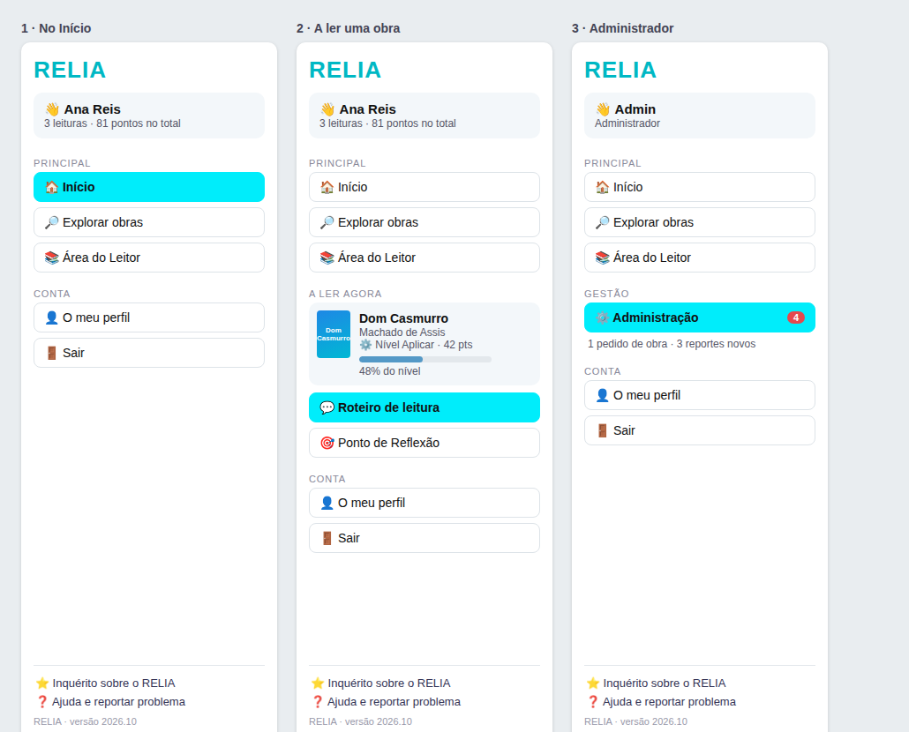

# Barra lateral: proposta para rever

**Estado (3 de outubro):** aprovada e implementada no [PR #15](https://github.com/rshermans/reliia/pull/15).

Decisões do utilizador:
1. A estrutura serve, sem alterações por agora.
2. Aceita a biblioteca `segno` (QR gerado a partir da ligação configurada).
3. Email de ajuda: **relia.informa@gmail.com** (o endereço veio sem o `@`; assumi-o). Contacto, termos e privacidade: ver [`inquerito-contacto-termos.md`](inquerito-contacto-termos.md).
4. Seletor de idioma removido. O português de **Portugal** é a predefinição, com opção do **Brasil** no perfil.
5. Ideia nova, tratada à parte: um inquérito dentro da aplicação.

Texto original da proposta:
Maquete dos três estados (início, a ler uma obra, administrador): [`maquete.png`](maquete.png).

## 1. O que não funciona hoje

Lido em `views/sidebar.py`, `views/chat.py` e `views/area_do_leitor.py`.

| Problema | Onde se vê |
|---|---|
| Os botões são sempre os mesmos, por ordem de código, sem grupos nem destaque do sítio onde se está | 5 botões iguais: Início, Atualizar Perfil, Área do Leitor, Escolher Outra Obra, Sair |
| «Voltar ao Início» e «Escolher Outra Obra» fazem quase o mesmo: limpam a obra e saem. «Escolher Outra Obra» aparece até no Perfil e na Administração, onde não faz sentido | |
| O nível do leitor nunca aparece. Os pontos só aparecem no chat e no Ponto de Reflexão, e não há ligação direta entre os dois | A leitura corrente não tem presença na barra |
| «Recuperar Senha» nunca aparece: depende de uma marca (`botao_recuperar_senha`) que nenhum código define | Código morto |
| **Seletor de idioma desativado** (`disabled=True`), só aparece dentro do chat, e só muda a frase de sistema da IA | Ver secção 4 |
| A Administração é um botão igual aos outros, sem sinal de que há reportes ou pedidos à espera | |
| **Inquérito:** o endereço `https://bit.ly/Zoho-RELIA` está escrito no código em dois sítios (barra lateral e Área do Leitor), e a Área do Leitor usa uma imagem de QR fixa desse endereço. Para o trocar é preciso mexer no código e refazer a imagem | Ver secção 3 |
| O botão do inquérito tem 150 linhas de CSS com três animações contínuas (brilho, pulso e estrela a rodar), incómodo para quem lê, e texto claro sobre fundo claro | |
| Os links «Ajuda» e «Reportar um problema» do menu do Streamlit apontam para `reliaapp.com`, que provavelmente não existe | `st.set_page_config` |

## 2. A barra proposta

Princípios: um sítio para cada coisa; o que o leitor está a ler fica sempre à vista, com o nível e os pontos; a página onde se está aparece destacada; só se mostra o que faz sentido naquele momento.

**Grupos e botões**

| Grupo | Botões | Quando aparece |
|---|---|---|
| Cartão do utilizador | Nome e resumo: «3 leituras · 81 pontos no total» (administrador: «Administrador») | Sempre, com sessão iniciada |
| **Principal** | 🏠 Início · 🔎 Explorar obras · 📚 Área do Leitor | Sempre |
| **A ler agora** | Capa, título e autor da obra, **nível, pontos e barra de progresso da obra**, e dois botões: 💬 Roteiro de leitura · 🎯 Ponto de Reflexão | Só enquanto há uma obra aberta (chat ou Ponto de Reflexão) |
| **Gestão** | ⚙️ Administração, com um número vermelho (reportes novos + pedidos de obra à espera) | Só administradores |
| **Conta** | 👤 O meu perfil · 🚪 Sair | Sempre |
| Rodapé | ⭐ Inquérito · ❓ Ajuda e reportar problema · versão | Sempre, ligações configuráveis (secção 3) |

**O que muda face a hoje**
- «Voltar ao Início» passa a «Início» e «Escolher Outra Obra» passa a «Explorar obras» (abre o catálogo, ou a pesquisa livre se o catálogo estiver desligado). Já não há dois botões com o mesmo efeito, e «Explorar obras» está sempre no mesmo sítio.
- A obra em leitura tem presença própria: o leitor passa do chat ao Ponto de Reflexão (e volta) sem perder o sítio, e vê o nível e os pontos em qualquer ecrã.
- No Início, o cartão mostra o total de leituras e de pontos, calculado com a mesma consulta do painel (sem gastar nada de IA).
- O botão do sítio atual fica **destacado** (azul do RELIA); os restantes são neutros.
- Os números do administrador vêm de uma consulta leve, guardada em cache 60 segundos, para não pesar a cada interação.
- Sem animações permanentes. O inquérito passa a ser uma ligação discreta no rodapé.
- «Recuperar Senha» sai da barra lateral (era código morto); continua no ecrã de entrada, onde faz sentido.
- Em ecrãs pequenos a barra abre recolhida (`initial_sidebar_state="auto"`), em vez de tapar o conteúdo.
- Por baixo, o menu fica descrito como dados (rótulo, ícone, ecrã de destino, quando aparece), o que torna fácil acrescentar ou mudar um botão sem mexer em vários `if`.

## 3. Inquérito configurável (e ligações de ajuda)

Em **Administração → ⚙️ Sistema → Definições**, três campos guardados na base de dados (`configuracoes`), com efeito imediato e sem alterar o código:

| Campo | Notas |
|---|---|
| **Ligação do inquérito** | Só aceita `http://` ou `https://` completos. Vazio = o inquérito não aparece em lado nenhum |
| **Texto do botão** | Por omissão «Inquérito sobre o RELIA» |
| **Onde aparece** | Escolha: barra lateral (rodapé), Área do Leitor, Início. Por omissão, os dois primeiros, como hoje |

- **QR do inquérito:** a Área do Leitor passa a gerar o QR a partir da ligação configurada, em vez de usar a imagem fixa, para o QR nunca ficar desatualizado depois de uma troca. Precisa de uma biblioteca pequena e sem dependências (`segno`, cerca de 100 KB). Se preferir não acrescentar nada, ficaria só a ligação.
- A alteração fica na auditoria (antes e depois).
- **Ajuda e reportar problema:** o mesmo painel teria uma ligação de ajuda e outra de reporte (por exemplo, um email ou um formulário), usadas no rodapé e no menu do Streamlit. Vazias, desaparecem em vez de apontarem para uma página que não existe.

## 4. O idioma: faz sentido manter?

**O estado atual.** O seletor oferece Português (Brasil), Português (Portugal), Inglês e Espanhol, mas:
- está **desativado**, por isso nunca muda de valor, e só é desenhado dentro do chat;
- o único efeito é a frase de sistema enviada à IA, e as de Português (Brasil) e Português (Portugal) são idênticas;
- tudo o resto está em português: os ecrãs, as perguntas, as estratégias, as fichas e os relatórios.

Ou seja, hoje é um controlo que não controla nada, e que sugere um suporte multilíngue que a aplicação não tem.

**Recomendação.**
1. **Remover o seletor** da barra lateral e a lógica à volta (`views/chat.py`, `streamlit_app.py`).
2. **Não oferecer inglês nem espanhol por agora.** Para serem honestos teriam de se traduzir os ecrãs, as perguntas e as fichas, e validar a IA nessas línguas. É um projeto à parte, e fica registado como possibilidade futura.
3. **Acrescentar uma opção que tem utilidade real:** a **variante do português**, *Português de Portugal* ou *Português do Brasil*, no perfil de cada leitor (e no registo). Passa a ser enviada à IA nos resumos, respostas do chat, perguntas abertas e avaliações («escreva em português de Portugal, com a ortografia e o vocabulário de Portugal» / «do Brasil»), o que resolve diferenças como *aspetos/aspectos*, *ecrã/tela* ou *autocarro/ônibus* nas respostas da IA. Os textos fixos da aplicação ficam como estão.

Se preferir não ter esta opção, o ponto 1 basta, e a barra fica sem nada sobre idioma.

## 5. Como entraria na aplicação

Um só PR, pequeno e fácil de reverter:
1. `views/sidebar.py` reescrito (menu como dados, estado «a ler agora», selo do administrador, rodapé), sem alterar nenhum ecrã.
2. Definições do inquérito e das ligações em Administração → Sistema (tabela `configuracoes`, já existente; sem tabelas novas).
3. QR gerado a partir da ligação (se aprovar a biblioteca).
4. Remoção do seletor de idioma e, se aprovar, a variante do português: uma coluna nova em `usuarios` (`variante_pt`, por omissão vazia = comportamento de hoje), um campo no perfil e uma frase a mais nos pedidos à IA.

Nada para de funcionar durante a mudança: os ecrãs e a navegação (`st.session_state["tela"]`) são os mesmos; só muda o desenho da barra.

## 6. O que preciso de si

1. A estrutura da barra (secção 2) serve? Quer mudar nomes, ordem ou acrescentar/tirar algum botão?
2. **Inquérito:** o painel de definições (ligação, texto, onde aparece) serve? Aceita a biblioteca do QR (`segno`), ou prefere só a ligação?
3. **Ajuda e reportar problema:** que ligação ou email quer usar? Pode ficar vazio por agora.
4. **Idioma:** concorda em remover o seletor? Quer a **variante do português** no perfil? Se sim, qual é a predefinição para quem ainda não escolheu: Português de Portugal, Português do Brasil, ou «sem preferência» (comportamento de hoje)?
